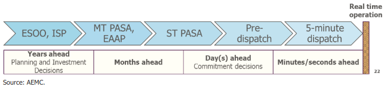

# nemseer

[](https://badge.fury.io/py/nemseer)
[](https://github.com/UNSW-CEEM/NEMSEER/actions/workflows/cicd.yml)
[](https://nemseer.readthedocs.io/en/latest/?badge=latest)
[](https://codecov.io/gh/UNSW-CEEM/NEMSEER)
[](https://github.com/psf/black)

A package for downloading and handling historical National Electricity Market (NEM) forecast data produced by the Australian Energy Market Operator (AEMO).

## Installation

```bash
pip install nemseer
```

## Overview

`nemseer` allows you to access historical AEMO [pre-dispatch](https://aemo.com.au/en/energy-systems/electricity/national-electricity-market-nem/data-nem/market-management-system-mms-data/pre-dispatch) and [Projected Assessment of System Adequacy (PASA)](https://wa.aemo.com.au/energy-systems/electricity/national-electricity-market-nem/nem-forecasting-and-planning/forecasting-and-reliability/projected-assessment-of-system-adequacy) forecast[^1] data available through the [MMSDM Historical Data SQLLoader](https://nemseer.readthedocs.io/en/latest/glossary.html#term-MMSDM-Historical-Data-SQLLOader). `nemseer` can then compile this data into [pandas DataFrames](https://pandas.pydata.org/pandas-docs/stable/user_guide/dsintro.html#dataframe) or [xarray Datasets](https://docs.xarray.dev/en/stable/user-guide/data-structures.html#dataset).



<sub><sup>Source: [Reserve services in the National Electricity Market, AEMC, 2021](https://www.aemc.gov.au/sites/default/files/2020-12/AEMC_Reserve%20services%20in%20the%20NEM%20directions%20paper_05.01.2021.pdf)</sup></sub>

Whereas PASA processes are primarily used to assess resource adequacy based on technical inputs and assumptions for resources in the market (i.e. used to answer questions such as *"can operational demand be met in the forecast horizon with a sufficient safety (reserve) margin?"*), pre-dispatch processes incorporate the latest set of market participant offers and thus produce regional prices forecasts for energy and frequency control ancillary services [(FCAS)](https://aemo.com.au/-/media/files/electricity/nem/security_and_reliability/ancillary_services/guide-to-ancillary-services-in-the-national-electricity-market.pdf). Overviews of the various pre-dispatch and PASA processes can be found in the [glossary](https://nemseer.readthedocs.io/en/latest/glossary.html).

[^1]: We use the term *"forecast"* loosely, especially given that these *"forecasts"* change once participants update offer information (e.g. through rebidding) or submit revised resource availabilities and energy constraints. Both of these are intended outcomes of these *"ahead processes"*, which are run to provide system and market information to participants to inform their decision-making. However, to avoid confusion and to ensure consistency with the language used by AEMO, we use the terms *"forecast"* (or outputs) and *"forecast types"* (or ahead processes) in `nemseer`.

`nemseer` enables you to download and work with data for the following forecast types. Where available, AEMO process and table descriptions are linked:

1. 5-minute pre-dispatch (`P5MIN`: [Table descriptions](https://nemweb.com.au/Reports/Current/MMSDataModelReport/Electricity/MMS%20Data%20Model%20Report_files/MMS_222.htm#1))
2. [Pre-dispatch](https://www.aemo.com.au/-/media/files/electricity/nem/security_and_reliability/power_system_ops/procedures/so_op_3704-predispatch.pdf?la=en) (`PREDISPATCH`: [Table descriptions](https://nemweb.com.au/Reports/Current/MMSDataModelReport/Electricity/MMS%20Data%20Model%20Report_files/MMS_260.htm#1))
3. Pre-dispatch Projected Assessment of System Adequacy (`PDPASA`: [Tables and Descriptions](https://nemweb.com.au/Reports/Current/MMSDataModelReport/Electricity/MMS%20Data%20Model%20Report_files/MMS_467.htm#1))
4. [Short Term Projected Assessment of System Adequacy](https://wa.aemo.com.au/-/media/files/electricity/nem/planning_and_forecasting/pasa/stpasa-process-description.pdf) (`STPASA`: [Table descriptions](https://nemweb.com.au/Reports/Current/MMSDataModelReport/Electricity/MMS%20Data%20Model%20Report_files/MMS_335.htm#1))
5. [Medium Term Projected Assessment of System Adequacy](https://wa.aemo.com.au/-/media/files/electricity/nem/planning_and_forecasting/pasa/mt-pasa-process-description-v62.pdf?la=en) (`MTPASA`: [Table descriptions](https://nemweb.com.au/Reports/Current/MMSDataModelReport/Electricity/MMS%20Data%20Model%20Report_files/MMS_210.htm#1))

Another helpful reference for PASA information is AEMO's [Reliability Standard Implementation Guidelines](https://www.aemo.com.au/-/media/files/electricity/nem/planning_and_forecasting/rsig/reliability-standard-implementation-guidelines.pdf?la=en).

### ST PASA Replacement Project

Note that the methodologies for PD PASA and ST PASA are being reviewed by AEMO. In particular, the ST PASA Replacement project will combine PD PASA and ST PASA into ST PASA. For more detail, refer to the [final determination of the rule change](https://www.aemc.gov.au/sites/default/files/2022-05/ERC0332%20-%20Updating%20Short%20Term%20PASA%20-%20Final%20determination.pdf) and the [AEMO ST PASA Replacement Project home page](https://aemo.com.au/en/initiatives/trials-and-initiatives/st-pasa-replacement-project).

## Usage

### Glossary

The [glossary](https://nemseer.readthedocs.io/en/latest/glossary.html) contains overviews of the PASA and pre-dispatch processes, and descriptions of terminology used in `nemseer`.

### Quick start

Check out the [Quick start](https://nemseer.readthedocs.io/en/latest/quick_start.html) for guide on to use `nemseer`.

### Examples

Some use case examples have been included in the [Examples](https://nemseer.readthedocs.io/en/latest/examples.html) section of the documentation.

## Contributing

Interested in contributing? Check out the [contributing guidelines](./CONTRIBUTING.md), which also includes steps to install `nemseer` for development.

Please note that this project is released with a [Code of Conduct](./CONDUCT.md). By contributing to this project, you agree to abide by its terms.

## License

`nemseer` was created by Abhijith Prakash. It is licensed under the terms of the [BSD 3-Clause license](./LICENSE).

## Credits

`nemseer` was created with [`cookiecutter`](https://cookiecutter.readthedocs.io/en/latest/) and the `py-pkgs-cookiecutter` [template](https://github.com/py-pkgs/py-pkgs-cookiecutter).

Thanks to Nicholas Gorman for his help in reviewing `nemseer` code and to Dylan McConnell for his assistance in interpreting PASA run types.
