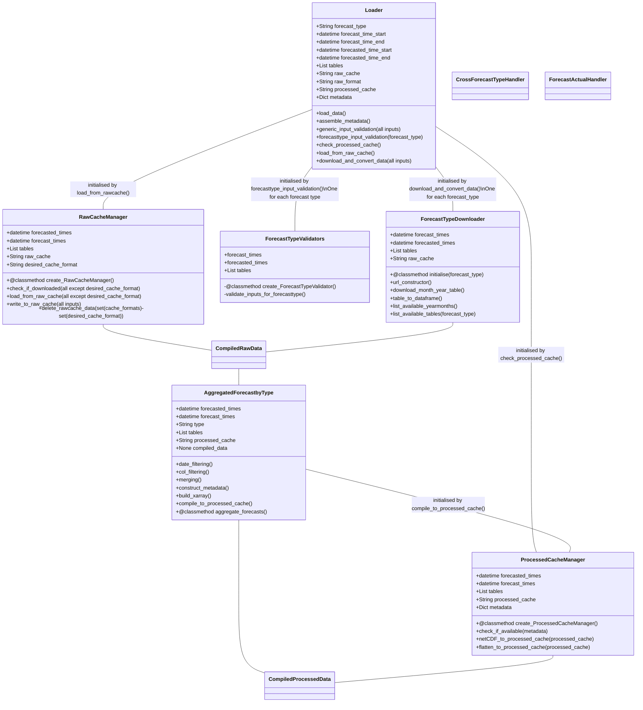

# Development Roadmap

## Process Description

### User Groups and Functionality

Two types of functionality would be exposed:
1. User functions (NEMOSIS-style) that enable the user to go end-to-end quickly. This would 'automate' the chain from raw cache/download to validation to aggregation to processed cache.
2. Advanced interface/API. Really this is just exposing the classes to the user so they can do more with it if need be

### Automated workflow

1. Loader is initialised with user input
2. Then:
    a) Loader checks metadata of netCDF via`CompiledProcessedData`. If no such metadata exists, proceed to b).
    b) Loader loads from the raw cache (via `CompiledRawData`), or dispatches a `ForecastTypeDownloader`. RawCache will consist of partioned parquet files (corresponding to original CSVs). Generic as well as forecast-specific validators should verify user inputs. Returns `CompiledRawData`.

3. If 2(a), then passed to `AggregatedForecastbyType` for data aggregation, filtering and building to processed cache
4. If 2(b), could then be passed to `AggregatedForecastbyType` for specific filtering?

By step 3/4, the datasets should be useful  enough to answer questions such as:
>I want to look at forecast convergence for 1 day of delivery, for predispatch runs as time approaches the delivery time.

5. `CompiledProcessedData` is saved as netCDF or flattened to csv via pandas. Metadata inserted into netCDF.

## Extensions

1. A very useful thing would be to have functionality to patch in NEMOSIS and do forecasts vs actual (`ForecastActualHandler`)

## Class Diagram

